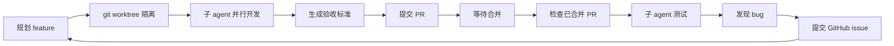

# coding-skill

个人编码 skill 集合，可通过 `npx skills add` 一键安装到任意 AI 编码工具（Claude Code、Cursor、Codex、OpenCode 等）。

## 安装

```bash
# 安装全部 skill
npx skills add https://github.com/KaraBilly/coding-skill

# 只装某一个，例如：
npx skills add https://github.com/KaraBilly/coding-skill --skill parallel-feature-workflow-zh

# 只装中文版（需要该语言的每个 skill 都指定一次）
npx skills add https://github.com/KaraBilly/coding-skill \
  --skill coding-workflow-zh \
  --skill parallel-feature-workflow-zh

# 只装英文版
npx skills add https://github.com/KaraBilly/coding-skill \
  --skill coding-workflow-en \
  --skill parallel-feature-workflow-en
```

> 说明：`npx skills` CLI 没有 `--language` 之类的语言筛选参数，按语言安装需用 `--skill <name>` 逐个指定该语言下的所有 skill。新增 skill 后记得同步更新上述命令。

## Skill 清单

### coding-workflow（通用编码工作流）

一套通用编码工作流规范，适用于任何非平凡（多文件、多步骤）的软件工程任务。

| 版本 | 说明 |
|------|------|
| `coding-workflow-en` | 英文版 |
| `coding-workflow-zh` | 中文版 |

核心规则：

1. **任务拆解** —— 大任务先拆成 tasks 并标注依赖关系，单 task 修改文件 ≤ 5 个。
2. **仓库上下文挖掘** —— 参考 `git log --since="2 months ago"`，贴合仓库风格、复用既有实现、规避历史坑。
3. **组件复用** —— 能复用就复用、不能复用就组合、组合不了再新建，杜绝重复代码。
4. **测试与报告** —— 每个任务补全测试用例，输出含用例清单、执行结果、复现步骤、覆盖缺口的测试报告。

### parallel-feature-workflow（多 feature 并行闭环）

面向"单日多 feature 并行开发"的编码习惯，形成 **开发 → 合并 → 测试 → 提交 issue → 再开发** 的自驱动闭环。

| 版本 | 说明 |
|------|------|
| `parallel-feature-workflow-en` | 英文版 |
| `parallel-feature-workflow-zh` | 中文版 |

核心循环：



该 skill 同时内置了「定时触发指引」，可按需配置为每日自动运行。

## 触发方式

- **手动触发**（默认）：直接说一句话，AI 会按 description 自动匹配并加载对应 skill。例如"今天开发这 3 个 feature：登录、支付、通知"。
- **定时触发**：按各 skill 内的「定时触发」模板，在 TRAE 的 Schedule 中配置。