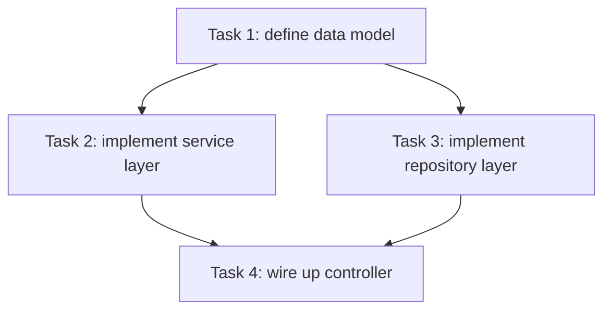

# Coding Workflow

A general-purpose coding workflow specification. Use it for any non-trivial (multi-file, multi-step) software engineering task — new features, bug fixes, refactoring, cross-layer changes, etc. Goals: predictable task decomposition, repository-consistent style, minimal duplicated code, and verifiable delivery.

## Workflow Overview

Execute the steps below in order; complete each before moving to the next:

1. **Understand & decompose** (task planning)
2. **Mine repository context** (git history + existing code)
3. **Check component reuse** (avoid reinventing the wheel)
4. **Implement** (deliver task by task)
5. **Test & report** (verify + produce a report)

---

## 1. Task Decomposition (required for large tasks)

Criterion: treat a task as "large" when it is expected to touch **more than 3 files** or requires **multiple steps**. Large tasks must be planned first.

Requirements:

- Decompose the whole task into a set of `tasks`, tracked with TodoWrite.
- **Spell out dependencies between tasks**: which tasks must wait for predecessors, and which are independent and can run in parallel.
- **Constraint: a single task must not modify more than 5 files.** Split further if exceeded.
- Each task description must include: goal, files involved (with absolute paths), and acceptance criteria (how to know it is done).
- After decomposition, briefly explain the result and the dependency graph to the user (a text list or a mermaid diagram) before starting implementation.

Example (mermaid dependency graph):



---

## 2. Repository Context Mining (last two months of git)

Before writing any code, understand how this repository writes code and what it has been doing recently.

Steps:

1. Run `git log --since="2 months ago" --oneline` to get the last two months of commits.
2. Review commit messages and changed files to identify:
   - **Coding conventions and naming habits** (variable/function/file naming, directory structure).
   - **Recently active modules and refactoring directions**, to avoid conflicting with in-progress work.
   - **Reusable existing implementations** (the same functionality may already exist elsewhere).
   - **Historical bug-fix patterns**, to avoid known pitfalls.
3. Also check the current branch state (`git status`, `git diff`) for uncommitted changes.

Principle: **understand the repository's existing style before you start.** New code should continue the existing style, not start over.

Example commands:

```bash
git log --since="2 months ago" --oneline --stat
git log --since="2 months ago" --graph --decorate
```

---

## 3. Component Reuse (avoid duplicate code)

Before writing any new code, answer: "Does this already exist in the repository?"

Requirements:

- Before implementing each task, use Grep / Glob to search for existing:
  - utility functions, hooks, services, components, type definitions, constants, config.
- Prefer **reusing, composing, and extending** existing code over copy-paste or rewrite.
- Create new code only after confirming existing code truly cannot satisfy the need, and state the reason.
- Do not introduce duplicate logic: extract similar logic into a reusable unit instead of giving up after three duplicated lines.

Rule of thumb: **reuse when you can; compose when you can't reuse; build new only when you can't compose.**

---

## 4. Implementation (deliver task by task)

- Complete tasks in dependency order; mark each one done in TodoWrite immediately after finishing.
- Each task does only what falls within its scope — no unplanned "side optimizations".
- Minimal-change principle: add no features, error handling, or config beyond what was asked.
- Add comments only where logic is not self-evident; do not document code you did not change.

---

## 5. Testing & Reporting (required for every task)

After completing each task (especially business-logic ones), ensure tests are complete and produce a test report.

Requirements:

1. **Test cases**:
   - Prefer reusing/extending the repository's existing test framework and test files.
   - Cover: normal path, boundary conditions, and error/exception paths.
   - Each test case must explain "what it verifies and what the expected result is".
2. **Run tests**:
   - Run the relevant test commands and record real results.
   - If a test fails, fix and re-run; do not ship failing results.
3. **Produce a test report** that contains:
   - Test scope and a case list (one sentence per case summarizing what it verifies).
   - Actual execution results (pass / fail / skipped) and failure reasons.
   - **How to test**: steps and commands so the user or others can reproduce and verify.
   - Coverage gaps (scenarios not covered by automated tests, and why).

Test report template (markdown):

```markdown
## Test Report

### Scope
- modules / files involved ...

### Case list
| Case | Verifies | Result |
|------|----------|--------|
| ...  | ...      | ✅/❌ |

### Execution results
- Command: `...`
- Pass / fail summary, failure reasons ...

### How to test
1. ...
2. ...

### Coverage gaps
- ... (uncovered scenarios and reasons)
```

---

## General Constraints

- Language: respond and comment in the user's language (Chinese by default).
- Delivery cadence: for large tasks, present the decomposition and dependency graph first, then implement; do not write all the code in one silent burst.
- Always reference code locations with file links (`file:///` absolute paths).