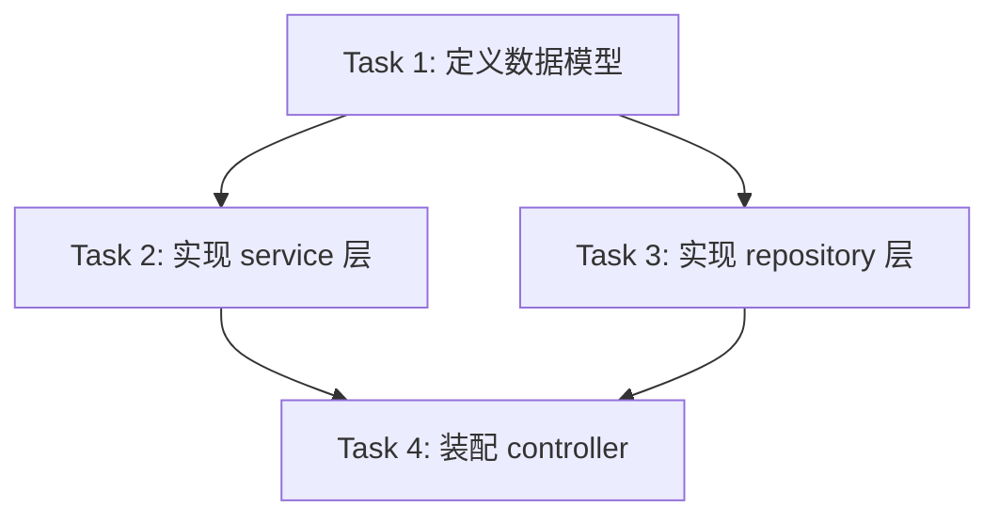

# 编码工作流

一套通用的编码工作流规范。适用于任何非平凡（多文件、多步骤）的软件工程任务——新增功能、修复 bug、重构、跨层改动等。目标是：可预测的任务拆解、贴合仓库风格、最少重复代码、可验证的交付。

## 工作流总览

按以下顺序执行，每一步都必须完成后再进入下一步：

1. **理解与拆解**（任务规划）
2. **仓库上下文挖掘**（git 历史 + 现有代码）
3. **组件复用检查**（避免重复造轮子）
4. **实现**（逐任务落地）
5. **测试与报告**（验证 + 输出报告）

---

## 1. 任务拆解（大任务必做）

判断标准：预计触及 **3 个以上文件** 或需要 **多步骤** 时，视为"大任务"，必须先规划。

要求：

- 先把整个任务拆解为一组 `tasks`，用 TodoWrite 记录。
- **明确任务间的依赖关系**：说明哪些 task 必须在前序 task 完成后才能开始；说明哪些 task 相互独立、可并行。
- **约束：单个 task 修改的文件数不超过 5 个。** 若超出，进一步拆分。
- 每个 task 描述要包含：目标、涉及文件（附绝对路径）、验收标准（如何判断完成）。
- 拆解完成后，向用户简要说明拆解结果与依赖图（可文字列表，也可用 mermaid 展示），再开始实现。

示例（mermaid 依赖图）：



---

## 2. 仓库上下文挖掘（git 最近两个月）

动手写代码前，先了解这个仓库怎么写代码、最近在做什么。

步骤：

1. 运行 `git log --since="2 months ago" --oneline` 获取最近两个月提交。
2. 审视提交信息与改动文件，识别：
   - **项目的编码规范与命名习惯**（变量/函数/文件命名、目录结构）。
   - **最近的活跃模块与重构方向**，避免与正在进行的工作冲突。
   - **可复用的既有实现**（同样功能可能已经在别处实现过）。
   - **历史 bug 修复模式**，规避踩过的坑。
3. 结合工区当前分支（`git status`、`git diff`）确认未提交改动。

原则：**先理解仓库既有风格，再动手**。新代码应延续现有风格，而不是另起炉灶。

示例命令：

```bash
git log --since="2 months ago" --oneline --stat
git log --since="2 months ago" --graph --decorate
```

---

## 3. 组件复用（避免重复代码）

写任何新代码之前，必须先回答："这个功能仓库里是不是已经有了？"

要求：

- 实现每个 task 前，用 Grep / Glob 搜索是否有现成的：
  - 工具函数、hooks、service、组件、类型定义、常量、配置。
- 优先 **复用、组合、扩展** 现有代码，而不是复制粘贴或重写。
- 只有确认现有代码确实无法满足需求时，才创建新代码，并说明原因。
- 禁止产生重复逻辑：相似逻辑应抽取为可复用单元，而不是三行代码重复三遍就投降。

判断口诀：**能被复用就复用；不能复用就组合；组合不了再新建。**

---

## 4. 实现（逐任务落地）

- 按依赖顺序逐个完成 task，完成一个立即在 TodoWrite 中标记完成。
- 每个 task 只做该 task 范围内的事，不做计划外的"顺手优化"。
- 最小改动原则：不添加需求之外的功能、错误处理、配置项。
- 只在逻辑不够自明时加注释；不为没改动的代码添加文档。

---

## 5. 测试与报告（每个任务必做）

每个 task（尤其是涉及业务逻辑的）完成后，都要保证测试完整，并输出测试报告。

要求：

1. **测试用例**：
   - 优先复用/补充仓库已有的测试框架与测试文件。
   - 覆盖：正常路径、边界条件、异常/错误路径。
   - 测试用例要能解释"验证了什么、预期结果是什么"。
2. **执行测试**：
   - 运行相关测试命令，记录真实结果。
   - 若测试失败，修复后重跑，不提交未通过的结果。
3. **输出测试报告**，须包含以下内容：
   - 测试范围与用例清单（每个用例一句话说明验证点）。
   - 实际执行结果（通过 / 失败 / 跳过）与失败原因。
   - **如何测试**：给出让用户/他人能复现验证的步骤和命令。
   - 覆盖缺口（哪些场景未被自动化测试覆盖，原因）。

测试报告模板（markdown）：

```markdown
## 测试报告

### 测试范围
- 涉及模块 / 文件 ...

### 用例清单
| 用例 | 验证点 | 结果 |
|------|--------|------|
| ...  | ...    | ✅/❌ |

### 执行结果
- 命令：`...`
- 通过 / 失败汇总，失败原因 ...

### 如何测试
1. ...
2. ...

### 覆盖缺口
- ...（未覆盖场景及原因）
```

---

## 通用约束

- 语言：回应与代码注释使用用户语言（默认中文）。
- 交付节奏：大任务先给拆解与依赖图，再实现；不要一次性闷头写完全部代码。
- 始终用文件链接（`file:///` 绝对路径）引用代码位置。