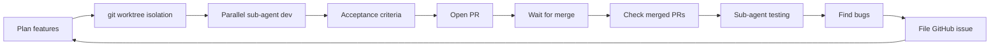

# Parallel Feature Workflow

A daily coding habit that turns multiple concurrent features into a self-reinforcing loop: **develop → merge → test → file issue → develop again**. Each feature is isolated in its own git worktree and developed by a parallel sub-agent.

## When to Use

- Multiple features need to be developed on the same day.
- Several independent tasks should advance in parallel, each in its own isolated workspace and each able to open its own PR.
- You want an automated "post-merge test → bug-to-issue" feedback loop.

## The Core Loop



## Workflow Steps

### Phase 1 — Plan & develop in parallel

1. List all features for the day.
2. Create one isolated git worktree per feature (branch off main) so they never interfere:
   ```bash
   git worktree add ../repo-feature-a -b feature/feature-a
   ```
3. Dispatch one sub-agent per feature to develop in parallel; none blocks the others.
4. Generate an **acceptance criteria** block for each feature, covering:
   - Goal and scope
   - Files involved
   - Verifiable outcome (how to know "done")
   - Testing points

### Phase 2 — Open PRs and wait for merge

5. Open a PR once a feature is done:
   ```bash
   gh pr create --title "..." --body "..."
   ```
6. Wait for review and merge; keep working on other features meanwhile.

### Phase 3 — Check merge status

7. Check which features have been merged:
   ```bash
   gh pr list --state merged
   gh pr status
   ```

### Phase 4 — Test merged features

8. Dispatch sub-agents to test the merged features (prefer the repo's existing test framework).
9. Record results and identify bugs.

### Phase 5 — File issues to close the loop

10. File found bugs as GitHub issues:
    ```bash
    gh issue create --title "..." --body "..."
    ```
11. Each issue becomes input for the next round of development, returning to Phase 1.

## Key Rules

- Keep each feature's touched files as isolated as possible to reduce merge conflicts.
- Clean up a worktree after its feature merges:
  ```bash
  git worktree remove ../repo-feature-a
  ```
- On test failure, record it as an issue first; decide whether to fix it in this round afterwards.

---

## Scheduled Trigger (optional)

This skill triggers on demand by default. To run it automatically every day, configure a TRAE scheduled task with the following trigger message:

```text
Use the parallel-feature-workflow-en skill to run today's multi-feature development loop:
1. Read all open issues from GitHub repo <owner/repo> as today's features to develop;
2. Create an isolated git worktree per feature and dispatch a parallel sub-agent per feature, each generating acceptance criteria and opening a PR;
3. Check merged PRs and dispatch sub-agents to test the merged ones;
4. File bugs found during testing as GitHub issues to close the loop.
```

Recommended cron (weekdays 09:00, local time): `0 9 * * 1-5`

> Replace the `<owner/repo>` placeholder with the actual repository. Specify a timezone for the scheduled task, e.g. `Asia/Shanghai` for users in China.