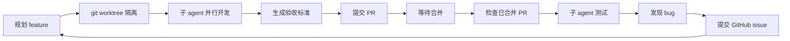

# 并行 Feature 工作流

一种"单日多 feature 并行开发"的编码习惯，形成 **开发 → 合并 → 测试 → 提交 issue → 再开发** 的自驱动闭环。每个 feature 用独立 git worktree 隔离，由独立子 agent 并行开发。

## 何时使用

- 当天需要同时开发多个 feature。
- 多个独立任务需要并行推进，各自在独立隔离的工作区里开发、各自单独提 PR。
- 需要自动化"合并后测试 → bug 转 issue"的反馈循环。

## 核心循环



## 工作流步骤

### 阶段 1 — 规划与并行开发

1. 列出当天所有 feature。
2. 为每个 feature 创建独立 git worktree（从 main 派生），互不干扰：
   ```bash
   git worktree add ../repo-feature-a -b feature/feature-a
   ```
3. 为每个 feature 派发一个子 agent 并行开发，互不阻塞。
4. 为每个 feature 生成一份**验收标准**，包含：
   - 目标与范围
   - 涉及文件
   - 可验证的结果（如何判断"完成"）
   - 测试要点

### 阶段 2 — 提交 PR 并等待合并

5. feature 完成后提交 PR：
   ```bash
   gh pr create --title "..." --body "..."
   ```
6. 等待审查与合并；期间继续推进其它 feature。

### 阶段 3 — 检查合并状态

7. 检查哪些 feature 已合并：
   ```bash
   gh pr list --state merged
   gh pr status
   ```

### 阶段 4 — 测试已合并 feature

8. 派子 agent 测试已合并的 feature（优先复用仓库已有测试框架）。
9. 记录结果、识别 bug。

### 阶段 5 — 提交 issue 形成闭环

10. 将发现的 bug 以 issue 提交到 GitHub：
    ```bash
    gh issue create --title "..." --body "..."
    ```
11. 每个 issue 又成为下一轮开发的输入，回到阶段 1。

## 关键约束

- 各 feature 触及的文件尽量隔离，减少合并冲突。
- feature 合并后清理 worktree：
  ```bash
  git worktree remove ../repo-feature-a
  ```
- 测试失败先记录为 issue，再决定是否本轮修复。

---

## 定时触发（可选）

本 skill 默认按需手动触发。如需每天自动运行，在 TRAE 的定时任务（Schedule）里配置，使用下面这段 trigger message 模板：

```text
使用 parallel-feature-workflow-zh skill 执行今日多 feature 并行开发循环：
1. 从 GitHub 仓库 <owner/repo> 读取所有 open issue 作为今日待开发 feature；
2. 为每个 feature 创建独立 git worktree 并派发子 agent 并行开发，各自生成验收标准并提 PR；
3. 检查已合并的 PR，对已合并项派子 agent 测试；
4. 将测试发现的 bug 以 issue 形式提交到 GitHub，形成闭环。
```

推荐 cron（每个工作日 09:00，按本地时区）：`0 9 * * 1-5`

> 占位符 `<owner/repo>` 需替换为实际仓库；定时任务需指定时区，例如中国用户用 `Asia/Shanghai`。